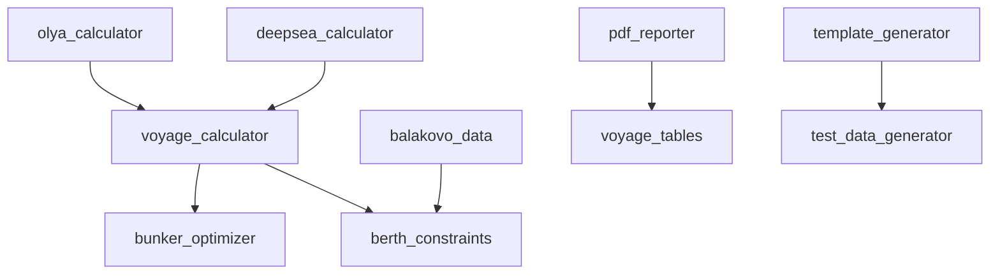

# Functional System Modules

In addition to the main logistics modules, the system includes a number of auxiliary components providing extended functionality.

## 1. Bunker Optimizer ([`bunker_optimizer.py`](../modules/bunker_optimizer.py))

Module for calculating and optimizing fuel costs.

* **Functions**:
  * Fuel consumption calculation for voyage (at sea and in port).
  * Comparison of bunkering costs at different ports along the route.
  * Recommendations for bunkering location (where it's cheaper considering detour).
* **Input Data**: Fuel prices (VLSFO, MGO), vessel consumption profile.

**Example Usage:**
```python
from modules.bunker_optimizer import BunkerOptimizer

optimizer = BunkerOptimizer()
result = optimizer.calculate_optimal_bunker_port(
    route=['Singapore', 'Dubai', 'Rotterdam'],
    fuel_prices={'Singapore': 450, 'Dubai': 420, 'Rotterdam': 480},
    consumption_rate=25.0  # tons/day
)
```

## 2. Access Control (RBAC) ([`rbac.py`](../modules/rbac.py))

Role-Based Access Control system for managing user permissions.

* **Roles**:
  * `Admin`: Full access to all system features.
  * `Manager`: Edit plans, but not system settings.
  * `Viewer`: Read-only access to reports  and data.
* **Functions**: User authentication, permission verification for API access.

**Role Hierarchy:**
```
Admin (full control)
  └── Manager (edit operations)
       └── Viewer (read-only)
```

**Implementation:**
```python
from modules.rbac import check_permission

@check_permission('manage_voyages')
def create_voyage(user, voyage_data):
    # Only users with 'manage_voyages' permission can execute
    pass
```

## 3. PDF Report Generator ([`pdf_reporter.py`](../modules/pdf_reporter.py))

Module for creating professional printable reports.

* **Capabilities**:
  * Generation of `Vessel_Schedule.pdf` with company logo.
  * Creation of executive summary reports.
  * Support for Cyrillic characters and table formatting.

**Available Report Types:**
1. **Voyage Schedule Report** - Complete vessel timeline
2. **Financial Summary** - Revenue and cost breakdown
3. **Fleet Utilization Report** - Performance metrics
4. **Berth Allocation Report** - Port operations overview

**Example:**
```python
from modules.pdf_reporter import PDFReporter

reporter = PDFReporter()
reporter.generate_voyage_schedule(
    vessels=vessel_list,
    period='2025-01-01,2025-12-31',
    output_path='reports/schedule_2025.pdf'
)
```

## 4. Constraint Validator ([`berth_constraints.py`](../modules/berth_constraints.py))

Universal rule-checking engine used by Balakovo module and others.

* **Validation Types**:
  * **Geometric**: Length, width, draft limitations
  * **Temporal**: Time interval conflicts detection
  * **Technological**: Cargo compatibility, loading rate constraints

**Constraint Categories:**

| Category | Examples | Priority |
|----------|----------|----------|
| Hard Constraints | Physical dimensions, safety rules | Must satisfy |
| Soft Constraints | Preferred times, optimal rates | Should satisfy |
| Preferences | Cost optimization, route preferences | Nice to have |

**Usage Pattern:**
```python
from modules.berth_constraints import validate_berth_assignment

result = validate_berth_assignment(
    vessel={'length': 180, 'beam': 28, 'draft': 8.5},
    berth={'max_length': 200, 'max_beam': 32, 'max_draft': 9.0},
    cargo={'type': 'coal', 'quantity': 50000}
)

if result.is_valid:
    # Proceed with assignment
    pass
else:
    # Handle violations
    for violation in result.violations:
        print(f"Constraint violated: {violation.description}")
```

## 5. UI Modules (Frontend)

Set of interactive web interface components:

### 5.1 Alerts Dashboard

Panel for displaying notifications about conflicts and important events.

**Features:**
- Real-time conflict detection
- Priority-based alert system
- Configurable notification thresholds
- Email/SMS integration ready

**Alert Types:**
-  Warning: Resource conflicts, schedule overlaps
-  Error: Validation failures, system errors
- ℹ Info: Status updates, completion notices
-  Success: Operation confirmations

### 5.2 Weather Integration

Display of weather forecasts and storm warnings.

**Data Sources:**
- OpenWeatherMap API
- Marine traffic data
- Historical weather patterns

**Capabilities:**
- 5-day forecast for route waypoints
- Storm tracking and alerts
- Wave height and wind speed analysis
- Route weather optimization suggestions

**Integration Example:**
```javascript
import { WeatherService } from './ui_modules/weather';

const weather = new WeatherService();
weather.getRouteWeather('Singapore', 'Rotterdam')
  .then(forecast => {
    // Display weather along route
    displayWeatherOverlay(forecast);
  });
```

### 5.3 Vessel Tracking

Visualization of current vessel positions on map.

**Features:**
- Real-time AIS data integration
- Historical track playback
- ETA calculations
- Port approach notifications

**Map Layers:**
- Vessel positions (with course and speed)
- Port locations
- Route lines
- Weather overlays
- Traffic density heatmaps

### 5.4 Voyage Builder

Constructor for manual creation of voyage chains.

**Capabilities:**
- Drag-and-drop voyage planning
- Multi-leg route creation
- Automatic TCE calculation
- Conflict detection
- Route optimization suggestions

**Workflow:**
1. Select vessel from fleet
2. Add cargo parcel(s)
3. Define loading/discharging sequence
4. Add canal transits and bunker stops
5. Validate schedule feasibility
6. Save or generate formal schedule

## 6. Data Integrations

### 6.1 Excel Integration ([`modules/voyage_tables.py`](../modules/voyage_tables.py))

Bidirectional data exchange with Excel:

**Import Capabilities:**
- Vessel particulars
- Cargo commitments
- Port schedule
- Freight rates

**Export Features:**
- Gantt chart to Excel
- Financial reports
- Voyage summaries
- Performance metrics

### 6.2 Database Connectors

Support for external databases:

**Supported Systems:**
- PostgreSQL
- MySQL
- Microsoft SQL Server
- Oracle Database

**Configuration Example:**
```yaml
database:
  type: postgresql
  host: localhost
  port: 5432
  database: vessel_scheduler
  username: admin
  pool_size: 10
```

## 7. Profiler and Performance Monitoring ([`profiler.py`](../modules/profiler.py))

Tools for system performance analysis and optimization.

**Metrics Tracked:**
- API response times
- Schedule generation duration
- Memory usage patterns
- Database query performance

**Usage:**
```python
from modules.profiler import profile_function

@profile_function
def generate_schedule(params):
    # Function execution time will be logged
    pass
```

**Performance Dashboard:**
- Real-time metrics display
- Historical trend charts
- Bottleneck identification
- Optimization recommendations

## 8. Template Management ([`template_generator.py`](../modules/template_generator.py))

System for managing reusable templates:

**Template Types:**
1. **Voyage Templates** - Standard route configurations
2. **Cargo Templates** - Frequent commodity specifications
3. **Report Templates** - Standard report formats
4. **Email Templates** - Notification messages

**Benefits:**
- Faster data entry
- Consistency across operations
- Reduced errors
- Easy customization

## 9. Test Data Generator ([`test_data_generator.py`](../modules/test_data_generator.py))

Utility for creating realistic test datasets.

**Generated Data:**
- Vessel fleet with realistic parameters
- Cargo parcels with market-based rates
- Port schedules
- Historical voyage data

**Use Cases:**
- System testing
- Performance benchmarking
- Training and demonstrations
- Development environment setup

**Example:**
```python
from modules.test_data_generator import generate_test_fleet

fleet = generate_test_fleet(
    vessel_count=50,
    vessel_types=['Capesize', 'Panamax', 'Handymax'],
    year=2025
)
```

## 10. Voyage Calculator ([`voyage_calculator.py`](../modules/voyage_calculator.py))

Core calculation engine for voyage economics.

**Calculations:**
- **Time Charter Equivalent (TCE)** - Daily earnings
- **Bunker Consumption** - Fuel costs
- **Port Costs** - All port-related expenses
- **Canal Dues** - Transit fees
- **Total Voyage P&L** - Complete profit/loss

**Formula Components:**
```
TCE = (Freight Revenue - Voyage Costs) / Voyage Duration

Voyage Costs = Bunker + Port Charges + Canal Dues + Other

Bunker Cost = (Sea Days × Sea Consumption × HFO Price) + 
              (Port Days × Port Consumption × MGO Price)
```

## Module Dependencies



## Integration Points

All modules are accessible via:

1. **Python API** - Direct module imports
2. **REST API** - HTTP endpoints via api_server_enhanced.py
3. **Vue.js Frontend** - Through API client service
4. **CLI Tools** - Command-line scripts

## Configuration

Module configuration is managed through:

- **[`config.yaml`](../config.yaml)** - Main system configuration
- **Environment variables** - Deployment-specific settings
- **Database parameters** - Connection and pool settings
- **Feature flags** - Enable/disable modules

**Example config.yaml:**
```yaml
modules:
  bunker_optimizer:
    enabled: true
    default_fuel_type: VLSFO
    price_api: 'http://bunkerindex.com/api'
  
  pdf_reporter:
    enabled: true
    logo_path: 'assets/company_logo.png'
    default_language: en
  
  rbac:
    enabled: true
    session_timeout: 3600  # seconds
```

## Best Practices

1. **Module Isolation** - Each module should be self-contained
2. **Error Handling** - Always use try-catch for external calls
3. **Logging** - Use structured logging for debugging
4. **Testing** - Write unit tests for each module
5. **Documentation** - Keep inline comments up to date

## Troubleshooting

### Common Issues

**Module Import Errors:**
```python
# Ensure modules directory is in Python path
import sys
sys.path.append('modules/')
```

**Configuration Not Loading:**
- Check config.yaml syntax
- Verify file permissions
- Confirm environment variables set

**Performance Issues:**
- Enable profiler to identify bottlenecks
- Check database indices
- Review caching strategy
- Consider async processing for heavy operations

## Future Enhancements

Planned module additions:

- **AI Optimizer** - Machine learning for route optimization
- **Blockchain Integration** - Smart contracts for cargo tracking
- **IoT Sensors** - Real-time vessel condition monitoring
- **Mobile App** - Native iOS/Android clients
- **Advanced Analytics** - Predictive modeling and forecasting

---

**For module-specific details, see:**
- [Balakovo Module Guide](MODULE_BALAKOVO_EN.md)
- [Deepsea Module Guide](MODULE_DEEPSEA_EN.md)
- [Olya Module Guide](MODULE_OLYA_EN.md)
- [API Reference](API_REFERENCE.md)
- [Developer Guide](DEVELOPER_GUIDE.md)
