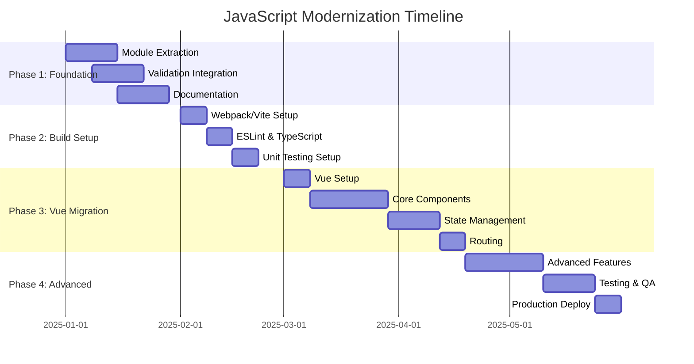

# JavaScript Modernization Plan

## Overview
This document outlines the plan for modernizing the vessel scheduler JavaScript codebase, including modularization, validation, documentation, and framework migration.

## Completed Tasks

### 1.  Missing Variables Defined
Created [`js/variables.js`](../js/variables.js) with:
- Global variable declarations (`totalRevenue`, `colorMap`, `data`)
- Library fallbacks (XLSX, html2pdf, vis.Network, PDFExport)
- Helper functions (`getOpCode`)
- Comprehensive error handling for missing dependencies

### 2.  API Input Validation
Created [`js/api-validation.js`](../js/api-validation.js) with:
- `APIValidator` class for comprehensive validation
- Validation rules for all entity types (vessels, cargo, routes, voyages, berth constraints, financial data)
- Type checking, range validation, pattern matching, enum validation
- Sanitization methods to prevent XSS and injection attacks
- Batch validation for arrays
- UI error display functionality

### 3.  API Documentation Generator
Created [`js/api-documentation-generator.js`](../js/api-documentation-generator.js) with:
- `APIDocumentationGenerator` class
- HTML and Markdown output formats
- Automatic endpoint registration
- Parameter and response documentation
- Example code generation
- Download functionality for both formats

## Pending Tasks

### 4. ⏳ Split Large JavaScript Files into Modules

#### Current State
- [`vessel_scheduler_enhanced.js`](../vessel_scheduler_enhanced.js): **~5000 lines** - needs splitting
- [`voyage-planner-functions.js`](../voyage-planner-functions.js): **~500 lines** - manageable but could be improved
- [`ui_modules/berth_management/berth_management.js`](../ui_modules/berth_management/berth_management.js): **~850 lines** - well-structured

#### Proposed Module Structure

```
js/
├── core/
│   ├── app-state.js          # Application state management
│   ├── config.js             # Configuration and settings
│   └── utils.js              # Utility functions
├── modules/
│   ├── vessel-management.js  # Vessel CRUD operations
│   ├── cargo-management.js   # Cargo operations
│   ├── route-management.js   # Route operations
│   ├── voyage-builder.js     # Voyage creation and validation
│   ├── gantt-chart.js        # Gantt visualization
│   ├── financial-analysis.js # Financial calculations
│   ├── exports.js            # Excel/PDF export functions
│   └── network-viz.js        # Network visualization
├── services/
│   ├── api-client.js         # API communication layer
│   └── storage-service.js    # LocalStorage operations
└── ui/
    ├── dashboard.js          # Dashboard view
    ├── filters.js            # Filter components
    ├── modals.js             # Modal dialogs
    └── notifications.js      # Notification system
```

### 5. ⏳ Add Input Validation to Existing Code

#### Integration Points
1. **Form Submissions**: Add validation before API calls
   - Vessel form
   - Cargo form
   - Route form
   - Constraint form

2. **Import Functions**: Validate CSV data before processing
   - `handleFileUpload()`
   - `parseCSV()`

3. **API Calls**: Validate all outgoing requests
   - `/api/calculate`
   - `/api/vessels`
   - `/api/cargo`
   - `/api/voyage-templates`

#### Example Integration
```javascript
// Before
function saveVessel() {
    const vesselData = {
        id: document.getElementById('vesselId').value,
        name: document.getElementById('vesselName').value,
        // ...
    };
    
    fetch('/api/vessels', {
        method: 'POST',
        body: JSON.stringify(vesselData)
    });
}

// After
function saveVessel() {
    const vesselData = {
        id: document.getElementById('vesselId').value,
        name: document.getElementById('vesselName').value,
        // ...
    };
    
    const validation = apiValidator.validateAndSanitize('vessel', vesselData);
    
    if (!validation.valid) {
        apiValidator.displayErrors(validation.errors);
        return;
    }
    
    fetch('/api/vessels', {
        method: 'POST',
        body: JSON.stringify(validation.data)
    });
}
```

### 6. ⏳ Modern Frontend Framework Migration

#### Recommended Framework: **Vue.js 3**

**Why Vue.js?**
-  Gentle learning curve
-  Progressive adoption (can integrate gradually)
-  Excellent documentation
-  Built-in state management (Pinia)
-  Component-based architecture
-  TypeScript support
-  Great ecosystem (Vue Router, Vuetify)

#### Migration Strategy (Phased Approach)

**Phase 1: Setup & Foundation** (1-2 weeks)
- Install Vue.js via CDN or npm
- Create Vue app wrapper
- Setup component structure
- Migrate utility functions

**Phase 2: Component Migration** (3-4 weeks)
1. Convert dashboard to Vue component
2. Convert vessel management to Vue component
3. Convert cargo management to Vue component
4. Convert route management to Vue component
5. Convert voyage builder to Vue component

**Phase 3: State Management** (1-2 weeks)
- Setup Pinia store
- Migrate [`appState`](../vessel_scheduler_enhanced.js:19) to Pinia
- Replace LocalStorage with Pinia persistence

**Phase 4: Routing** (1 week)
- Setup Vue Router
- Migrate tab system to routes
- Implement navigation guards

**Phase 5: Advanced Features** (2-3 weeks)
- Migrate Gantt chart (consider Vue wrapper for D3.js)
- Migrate financial analysis
- Migrate export functionality
- Add unit tests (Vitest)

**Phase 6: Optimization & Deployment** (1 week)
- Code splitting
- Lazy loading
- Build optimization
- Production deployment

#### Alternative Framework Options

**React**
- Pros: Largest ecosystem, excellent for complex UIs
- Cons: Steeper learning curve, more boilerplate

**Angular**
- Pros: Enterprise-ready, full-featured framework
- Cons: Very steep learning curve, heavyweight

**Svelte**
- Pros: No virtual DOM, excellent performance
- Cons: Smaller ecosystem, fewer third-party components

## Implementation Checklist

### Immediate Actions
- [ ] Create modular file structure
- [ ] Extract vessel management functions to `modules/vessel-management.js`
- [ ] Extract cargo management to `modules/cargo-management.js`
- [ ] Extract route management to `modules/route-management.js`
- [ ] Create API client service
- [ ] Integrate API validation in all forms
- [ ] Add validation error display components

### Short-term (1-2 months)
- [ ] Complete module extraction
- [ ] Add comprehensive JSDoc comments
- [ ] Create unit tests for core modules
- [ ] Setup build process (Webpack or Vite)
- [ ] Implement code linting (ESLint)
- [ ] Add TypeScript type definitions

### Long-term (3-6 months)
- [ ] Begin Vue.js migration (Phase 1)
- [ ] Migrate core components (Phase 2)
- [ ] Implement state management (Phase 3)
- [ ] Add routing (Phase 4)
- [ ] Complete advanced features (Phase 5)
- [ ] Production deployment (Phase 6)

## Dependencies to Add

### Current State
```html
<!-- Required libraries (must be included in HTML) -->
<script src="https://cdn.sheetjs.com/xlsx-latest/package/dist/xlsx.full.min.js"></script>
<script src="https://cdnjs.cloudflare.com/ajax/libs/html2pdf.js/0.10.1/html2pdf.bundle.min.js"></script>
<script src="https://unpkg.com/vis-network/standalone/umd/vis-network.min.js"></script>
```

### Future State (with build process)
```json
{
  "dependencies": {
    "vue": "^3.3.0",
    "pinia": "^2.1.0",
    "vue-router": "^4.2.0",
    "axios": "^1.6.0",
    "xlsx": "^0.18.5",
    "@vueuse/core": "^10.7.0",
    "chart.js": "^4.4.0",
    "vis-network": "^9.1.0"
  },
  "devDependencies": {
    "vite": "^5.0.0",
    "@vitejs/plugin-vue": "^4.5.0",
    "typescript": "^5.3.0",
    "eslint": "^8.55.0",
    "vitest": "^1.0.0"
  }
}
```

## Performance Improvements

### Current Issues
1. Large monolithic files slow down initial load
2. No code splitting
3. No lazy loading
4. No build optimization
5. Duplicate code across modules

### Solutions
1. **Module Splitting**: Reduce initial bundle size
2. **Lazy Loading**: Load components on demand
3. **Code Splitting**: Separate vendor and app code
4. **Tree Shaking**: Remove unused code
5. **Minification**: Reduce file sizes
6. **Caching**: Implement service workers

### Expected Results
- **Initial Load Time**: 3-5s → <2s
- **Time to Interactive**: 5-8s → <3s
- **Bundle Size**: ~500KB → ~150KB (initial) + lazy chunks
- **Lighthouse Score**: 60-70 → 90+

## Testing Strategy

### Unit Tests
```javascript
// Example unit test
import { describe, it, expect } from 'vitest';
import { apiValidator } from './api-validation';

describe('APIValidator', () => {
    it('should validate vessel data correctly', () => {
        const validVessel = {
            id: 'V001',
            name: 'Test Vessel',
            class: 'Handysize',
            dwt: 35000,
            speed: 14
        };
        
        const result = apiValidator.validate('vessel', validVessel);
        expect(result.valid).toBe(true);
        expect(result.errors).toHaveLength(0);
    });
    
    it('should reject invalid vessel data', () => {
        const invalidVessel = {
            id: '',
            name: 'Test',
            class: 'InvalidClass',
            dwt: -1000,
            speed: 100
        };
        
        const result = apiValidator.validate('vessel', invalidVessel);
        expect(result.valid).toBe(false);
        expect(result.errors.length).toBeGreaterThan(0);
    });
});
```

### Integration Tests
- Test API communication
- Test state management
- Test routing
- Test form submissions

### E2E Tests (Playwright/Cypress)
- Test complete user workflows
- Test cross-browser compatibility
- Test responsive design

## Documentation

### Code Documentation
- [x] Add JSDoc comments to new modules
- [ ] Add JSDoc to existing code
- [ ] Generate API documentation
- [ ] Create component documentation

### User Documentation
- [ ] Update user guide with new features
- [ ] Create video tutorials
- [ ] Add inline help tooltips
- [ ] Create FAQ section

## Migration Timeline



## Conclusion

This modernization plan provides a comprehensive roadmap for transforming the vessel scheduler JavaScript codebase from a monolithic structure to a modern, modular, maintainable application. The phased approach allows for gradual migration without disrupting current functionality, while the validation and documentation improvements provide immediate benefits.

**Next Steps:**
1. Review and approve this plan
2. Begin Phase 1: Module extraction
3. Integrate validation into existing code
4. Setup build process
5. Plan Vue.js migration kickoff
