# Project Structure Analysis

This document provides a comprehensive analysis of the project's structure, including functions, classes, and a dependency graph.

## 1. Python Components

### Root Scripts

#### `api_server.py`
*   **Description**: Flask API Server providing REST endpoints for schedule generation and Excel export.
*   **Functions**:
    *   `serve_static(path)`: Serves static files.
    *   `index()`: Renders the main page.
    *   `health_check()`: API health check.
    *   `handle_vessels()`: GET/POST vessel data.
    *   `handle_cargo()`: GET/POST cargo data.
    *   `generate_schedule()`: Triggers schedule calculation (Deep Sea / Olya).
    *   `export_gantt()`: Exports Gantt chart to Excel.
    *   `export_fleet_overview()`: Exports fleet overview.
    *   `export_voyage_summary()`: Exports voyage summary.
    *   `calculate()`: Unified calculation endpoint.
    *   `get_gantt_data()`: Returns calculated Gantt data.
    *   `export_excel()`: Generic Excel export.
    *   `upload_file(upload_type)`: Handles CSV uploads.
    *   `upload_csv()`: Legacy CSV upload.
    *   `get_dashboard_stats()`: Returns dashboard statistics.

#### `app.py`
*   **Description**: Alternative Flask Web Application integrating modules with a web interface.
*   **Functions**:
    *   `index()`: Serves main HTML.
    *   `static_files(filename)`: Serves static files.
    *   `upload_file(file_type)`: Uploads and parses Excel/CSV files.
    *   `calculate_voyages()`: Calculates voyage schedules.
    *   `get_voyages()`: Returns calculated voyage data.
    *   `get_alerts()`: Returns alerts.
    *   `get_berth_utilization()`: Returns berth utilization analysis.
    *   `generate_balakovo()`: Generates Balakovo report.
    *   `export_excel()`: Exports results to Excel.
    *   `get_gantt_data()`: Returns Gantt chart data.

#### `scheduler.py`
*   **Description**: Unified CLI entry point for all scheduling modules.
*   **Functions**:
    *   `setup_logging()`: Configures logging.
    *   `print_banner()`: Prints application banner.
    *   `print_menu()`: Prints interactive menu.
    *   `run_olya(input_dir, output_dir)`: Runs Olya transshipment planning.
    *   `run_deepsea(input_dir, output_dir)`: Runs Deep Sea voyage planning.
    *   `run_balakovo(input_dir, output_dir)`: Runs Balakovo berth planning.
    *   `run_all_modules()`: Runs all available modules.
    *   `interactive_mode()`: Runs interactive CLI loop.
    *   `main()`: Entry point parsing arguments.

#### `main.py`
*   **Description**: Another CLI entry point for the system.
*   **Functions**:
    *   `main()`: Entry point parsing arguments for various commands (`calculate`, `gantt`, `alerts`, etc.).
    *   `run_full_analysis(input_file, output_dir)`: Runs the full analysis pipeline.

### Modules (`modules/`)

#### `modules/olya_loader.py`
*   **Class `OlyaLoader`**:
    *   `__init__(input_dir)`
    *   `load()`: Loads all Olya data.
    *   `_read_csv(filename)`: Helper to read CSV.
    *   `_load_params()`: Loads parameters.
    *   `_load_ports()`: Loads ports.
    *   `_load_distances()`: Loads distances.
    *   `_load_fleet()`: Loads fleet data.
    *   `_load_voyage_configs()`: Loads voyage configurations.
    *   `_parse_date(value)`: Date parsing helper.
    *   `_print_summary(data)`: Prints data summary.

#### `modules/olya_coordinator.py`
*   **Class `OlyaCoordinator`**:
    *   `__init__(data)`
    *   `analyze()`: Performs coordination analysis (barge-vessel matching).
    *   `_add_recommendations(match)`: Adds recommendations to matches.
    *   `_print_report(analysis)`: Prints analysis report.
*   **Data Classes**: `Match`, `OlyaAnalysis`.

#### `modules/deepsea_loader.py`
*   **Class `DeepSeaLoader`**:
    *   `__init__(input_dir, voyage_plan_filename)`
    *   `load()`: Loads all Deep Sea data.
    *   `_read_csv(filename)`: Helper to read CSV.
    *   `_load_params()`: Loads parameters.
    *   `_load_ports()`: Loads ports.
    *   `_load_distances()`: Loads distances.
    *   `_load_canals()`: Loads canal data.
    *   `_load_fleet()`: Loads fleet data.
    *   `_load_routes()`: Loads routes and legs.
    *   `_load_voyage_plans()`: Loads voyage plans.
    *   `_parse_date(value)`: Date parsing helper.
    *   `_print_summary(data)`: Prints data summary.

#### `modules/deepsea_calculator.py`
*   **Class `DeepSeaCalculator`**:
    *   `__init__(data)`
    *   `calculate_all()`: Calculates all voyages.
    *   `_calculate_voyage(plan)`: Calculates a single voyage.
    *   `_calculate_leg(leg_template, plan, vessel, start_time)`: Calculates a single leg.
    *   `_calc_loading(...)`: Calculates loading time/cost.
    *   `_calc_discharge(...)`: Calculates discharge time/cost.
    *   `_calc_sea_leg(...)`: Calculates sea leg (time, distance, bunker).
    *   `_calc_canal(...)`: Calculates canal transit.
    *   `get_schedule_dataframe()`: Returns schedule as DataFrame.
    *   `get_voyage_summary_dataframe()`: Returns summary as DataFrame.
    *   `export_schedule_csv(filepath)`: Exports schedule to CSV.
    *   `export_summary_csv(filepath)`: Exports summary to CSV.

#### `modules/balakovo_loader.py`
*   **Class `BalakovoLoader`**:
    *   `__init__(input_dir)`
    *   `load()`: Loads all Balakovo data.
    *   `_read_csv(filename)`: Helper to read CSV.
    *   `_load_params()`: Loads parameters.
    *   `_load_berths()`: Loads berth data.
    *   `_load_fleet()`: Loads fleet data.
    *   `_load_cargo_plans()`: Loads cargo plans.
    *   `_load_restrictions()`: Loads restrictions.
    *   `_parse_date(value)`: Date parsing helper.
    *   `_validate(data)`: Validates loaded data.
    *   `_print_summary(data)`: Prints data summary.

#### `modules/balakovo_planner.py`
*   **Class `BalakovoPlanner`**:
    *   `__init__(data)`
    *   `plan()`: Executes the planning algorithm.
    *   `_find_vessel(cargo)`: Finds a suitable vessel for cargo.
    *   `_is_vessel_available(vessel, start, end)`: Checks vessel availability.
    *   `_find_berth(cargo, vessel)`: Finds a suitable berth.
    *   `_find_slot(cargo, vessel, berth)`: Finds a time slot for berthing.
    *   `_calculate_durations(cargo)`: Calculates operation durations.
    *   `_get_transition_time(...)`: Calculates transition/cleaning time.
    *   `_determine_start_time(...)`: Determines valid start time.
    *   `_is_window_valid(...)`: Checks window validity.
    *   `_validate_advanced_constraints(...)`: Checks advanced constraints.
    *   `_create_slot(...)`: Creates a `BerthingSlot`.
    *   `_add_conflict(...)`: Records a planning conflict.
    *   `_print_summary()`: Prints planning summary.
*   **Data Classes**: `PlanningConflict`.

## 2. JavaScript Components

### `vessel_scheduler_enhanced.js`
*   **State**: `appState` (stores current module, data for deepsea/balakovo/olya, filters, etc.).
*   **Initialization**:
    *   `initializeTabs()`
    *   `initializeFilters()`
    *   `initializeOpTypeFilters()`
    *   `loadFromLocalStorage()`
    *   `loadSampleData()` (fallback)
*   **UI Rendering**:
    *   `renderVesselsTable()`
    *   `renderCargoTable()`
    *   `renderRoutesTable()`
    *   `updateDashboard()`
    *   `populateFilterDropdowns()`
*   **Logic**:
    *   `switchModule()`: Switches between Deep Sea, Balakovo, Olya.
    *   `applyFilters()`: Applies global filters.
    *   `generateSchedule()`: Calls `/api/calculate` and renders Gantt.
    *   `generateAutoSchedule()`: Client-side simple scheduler (fallback).
    *   `generateGanttData()`: Prepares data for Gantt chart.
    *   `calculatePortStock()`: Calculates port stock levels.
    *   `calculateSalesPlan()`: Calculates sales plan gaps.
    *   `renderNetwork()`: Renders network graph using Vis.js.
*   **Data Handling**:
    *   `handleFileUpload(input, type)`: Uploads files to API.
    *   `parseCSV(content, type)`: Client-side CSV parsing.
    *   `saveToLocalStorage()` / `loadFromLocalStorage()`: Persistence.

### `voyage-planner-functions.js`
*   **Functions**:
    *   `displayGanttWithDates()`: Renders Gantt chart with date markers.
    *   `displayBerthGantt()`: Renders berth-centric Gantt chart.
    *   `displayCalendar()`: Renders calendar view of events.
    *   `exportToExcel()`: Exports calculated legs and summary to Excel.
    *   `displayBerthUtilization()`: Renders berth utilization stats.
    *   `downloadBerthUtilization()`: Exports berth utilization to Excel.

### `ui_modules/alerts_dashboard/alerts_dashboard.js`
*   **Class `AlertsDashboard`**:
    *   `constructor(config)`
    *   `init()`: Initializes dashboard.
    *   `render()`: Renders HTML structure.
    *   `loadAlerts()`: Fetches alerts from API.
    *   `processAlerts(newAlerts)`: Processes and deduplicates alerts.
    *   `updateUI()`: Updates stats and lists.
    *   `renderAlertsList()`: Renders active alerts.
    *   `renderAlertsHistory()`: Renders alert history.
    *   `acknowledgeAlert(id)`: API call to acknowledge.
    *   `resolveAlert(id)`: API call to resolve.
    *   `saveConfiguration()`: Saves settings.

## 3. Dependency Graph

```mermaid
graph TD
    %% Python Root
    API[api_server.py] --> DSL[DeepSeaLoader]
    API --> DSC[DeepSeaCalculator]
    API --> DSG[DeepSeaGanttExcel]
    API --> OL[OlyaLoader]
    API --> OC[OlyaCoordinator]
    API --> OGE[OlyaGanttExcel]
    API --> BL[BalakovoLoader]
    API --> BP[BalakovoPlanner]
    API --> BGE[BalakovoGanttExcel]
    API --> AE[api_extensions]

    APP[app.py] --> VC[VoyageCalculator]
    APP --> VT[VoyageTableGenerator]
    APP --> EG[excel_gantt]
    APP --> AL[AlertSystem]
    APP --> BU[BerthUtilizationAnalyzer]
    APP --> BR[BalakovoReportGenerator]

    SCH[scheduler.py] --> OL
    SCH --> OVC[OlyaVoyageCalculator]
    SCH --> OC
    SCH --> OGE
    SCH --> DSL
    SCH --> DSC
    SCH --> DSG
    SCH --> SM[ScenarioManager]
    SCH --> BL
    SCH --> BP
    SCH --> BGE

    MAIN[main.py] --> VC
    MAIN --> VT
    MAIN --> EG
    MAIN --> AL
    MAIN --> BU
    MAIN --> BR
    MAIN --> CT[create_templates]

    %% Modules - Deep Sea
    DSL --> DSD[DeepSeaData]
    DSC --> DSD
    DSC --> PROF[profiler]
    DSG --> DSD

    %% Modules - Olya
    OL --> OD[OlyaData]
    OC --> OD
    OGE --> OD
    OVC --> OD

    %% Modules - Balakovo
    BL --> BD[BalakovoData]
    BP --> BD
    BP --> BC[BerthConstraintValidator]
    BP --> PROF
    BGE --> BD

    %% Frontend
    JS[vessel_scheduler_enhanced.js] -- fetch --> API
    JS --> VPF[voyage-planner-functions.js]
    JS --> AD[AlertsDashboard]

    %% Styling
    classDef python fill:#f9f,stroke:#333,stroke-width:2px;
    classDef js fill:#ff9,stroke:#333,stroke-width:2px;
    classDef module fill:#9cf,stroke:#333,stroke-width:2px;

    class API,APP,SCH,MAIN python;
    class JS,VPF,AD js;
    class DSL,DSC,DSG,OL,OC,OGE,BL,BP,BGE,VC,VT,EG,AL,BU,BR,OVC,SM,CT,DSD,OD,BD,BC,PROF,AE module;
```

