# Backend-Frontend Integration Fix Plan

## Status: Task 1 of 8 Complete ✅

## Overview
This plan addresses the critical issues identified in the backend-frontend integration verification. The initial Code Skeptic review found 1 critical import error and 22 missing API endpoints.

---

## ✅ COMPLETED TASKS

### Task 1: Fix Critical Import Error
**Status:** ✅ COMPLETE  
**Evidence:** Backend server now imports successfully
```bash
python -c "import api_server_enhanced"
# Exit code: 0 ✓
```

**Changes Made:**
- Fixed import statement in [`api_server_enhanced.py:42-47`](../api_server_enhanced.py:42)
- Removed non-existent imports: `YearScheduleConfig`, `OptimizationResult`
- Stubbed out incompatible year schedule endpoints (returning HTTP 501)

---

## 📋 REMAINING TASKS

### Task 2: Verify Test Suite Can Run
**Priority:** HIGH  
**Goal:** Confirm the import fix allows pytest to collect and run tests

**Steps:**
1. Run: `python -m pytest tests/ --collect-only`
2. Verify 206 tests are collected without errors
3. Run: `python -m pytest tests/ -v -x` (stop on first failure)
4. Document which tests pass/fail
5. Identify any remaining import or dependency issues

**Success Criteria:**
- All 206 tests are collected successfully
- Test suite can execute (even if some tests fail)
- No collection errors

---

### Task 3: Standardize API Response Formats
**Priority:** HIGH  
**Goal:** Make all backend responses match the frontend's expected format

**Current Issue:**
Frontend expects (from [`src/services/api.ts`](../src/services/api.ts)):
```typescript
interface ApiResponse<T> {
  data: T;
  message?: string;
  status: string;
}
```

Backend returns inconsistent formats:
- `{'vessels': [...]}`  ← Direct data
- `{'success': True, ...}`  ← Different structure
- Plain JSON without wrapper

**Affected Endpoints:**
1. `/api/vessels` (GET)
2. `/api/cargo` (GET)
3. `/api/dashboard/stats` (GET)
4. All vessel/cargo/route CRUD endpoints

**Implementation Steps:**
1. Create a response wrapper helper function
2. Update all existing endpoints to use the wrapper
3. Test each endpoint's response structure
4. Verify frontend can parse responses correctly

**Success Criteria:**
- All GET endpoints return `{data: T, status: "success"}`
- All POST endpoints return `{data: T, status: "success", message: "..."}`
- Frontend services can parse responses without errors

---

### Task 4: Implement Missing Vessel Endpoints
**Priority:** MEDIUM  
**Goal:** Add 5 missing vessel-related endpoints

**Missing Endpoints:**
1. `GET /api/vessels/positions` - Get vessel positions
2. `GET /api/vessels/{id}/schedule` - Get vessel schedule
3. `POST /api/vessels/import` - Import vessels from file
4. `GET /api/vessels/export` - Export vessels to file
5. Ensure consistent response format for existing endpoints

**Implementation Notes:**
- Reuse existing vessel CSV reading logic for import/export
- Schedule endpoint should return voyage legs for the vessel
- Positions endpoint can return mock data initially

**Success Criteria:**
- All 5 endpoints return proper responses
- Frontend `vesselService` calls work without errors
- Export/import maintains data integrity

---

### Task 5: Implement Missing Cargo Endpoints
**Priority:** MEDIUM  
**Goal:** Add 4 missing cargo-related endpoints

**Missing Endpoints:**
1. `GET /api/cargo/port/{portId}` - Get cargo by port
2. `GET /api/cargo/statistics` - Get cargo statistics
3. `POST /api/cargo/import` - Import cargo from file
4. `GET /api/cargo/export` - Export cargo to file

**Implementation Steps:**
1. Add port filtering to existing cargo query logic
2. Calculate statistics from cargo data (total tonnage, count by commodity, etc.)
3. Reuse CSV upload logic for import
4. Create export functionality similar to vessels

**Success Criteria:**
- Port filter returns only cargo for specified port
- Statistics provide meaningful dashboard data
- Import/export functions work with CSV files

---

### Task 6: Implement Missing Voyage Endpoints  
**Priority:** HIGH  
**Goal:** Add RESTful voyage management API (17 missing endpoints)

**Missing Core CRUD:**
1. `GET /api/voyages` - List all voyages
2. `GET /api/voyages/{id}` - Get voyage by ID
3. `POST /api/voyages` - Create new voyage
4. `PUT /api/voyages/{id}` - Update voyage
5. `DELETE /api/voyages/{id}` - Delete voyage

**Missing Voyage Operations:**
6. `POST /api/voyages/calculate` - Calculate voyage details
7. `POST /api/voyages/{id}/optimize` - Optimize single voyage
8. `GET /api/voyages/{id}/financials` - Get financial breakdown
9. `GET /api/voyages/{id}/export` - Export voyage to PDF/Excel
10. `POST /api/voyages/generate-schedule` - Generate schedule

**Missing Template System:**
11. `GET /api/voyage-templates` - List templates
12. `GET /api/voyage-templates/{id}` - Get template
13. `POST /api/voyage-templates` - Create template
14. `PUT /api/voyage-templates/{id}` - Update template
15. `DELETE /api/voyage-templates/{id}` - Delete template
16. `POST /api/voyage-templates/{id}/apply` - Apply template

**Missing Scenario System:**
17. `GET /api/scenarios` - List scenarios
18. `GET /api/scenarios/{id}` - Get scenario
19. `POST /api/scenarios` - Create scenario
20. `PUT /api/scenarios/{id}` - Update scenario
21. `DELETE /api/scenarios/{id}` - Delete scenario
22. `POST /api/scenarios/compare` - Compare scenarios

**Implementation Strategy:**
1. Start with core CRUD using existing calculation logic
2. Adapt `/api/calculate` endpoint for voyages-specific calculation
3. Create template storage (JSON file or database)
4. Implement scenario comparison logic
5. Add proper error handling and validation

**Success Criteria:**
- Frontend `voyageService` can create/read/update/delete voyages
- Templates can be saved and applied
- Scenario comparison provides meaningful data

---

### Task 7: Add Integration Tests
**Priority:** MEDIUM  
**Goal:** Ensure backend-frontend integration works end-to-end

**Test Categories:**
1. **API Response Format Tests**
   - Verify all endpoints return correct format
   - Test error responses match expected structure
   
2. **CRUD Operation Tests**
   - Test vessel/cargo/voyage create-read-update-delete flows
   - Verify data persistence
   
3. **Module-Specific Tests**
   - Test deepsea calculations
   - Test olya calculations
   - Test balakovo planning
   
4. **Cross-Module Integration**
   - Test data flow from cargo → voyage → calculation
   - Verify export functions with real data

**Implementation:**
- Create `tests/integration/test_api_frontend.py`
- Use pytest fixtures for test data
- Mock frontend API calls where needed
- Verify responses match TypeScript interfaces

**Success Criteria:**
- All integration tests pass
- Code coverage > 80% for new endpoints
- No frontend runtime errors when calling APIs

---

###Task 8: Final Verification & Documentation
**Priority:** HIGH  
**Goal:** Prove all issues are resolved with concrete evidence

**Verification Steps:**
1. Run full test suite: `python -m pytest tests/ -v`
2. Start backend server: `python api_server_enhanced.py`
3. Test each missing endpoint manually with curl/Postman
4. Check frontend console for API errors
5. Generate test coverage report

**Documentation Requirements:**
1. Update API documentation with new endpoints
2. Create endpoint test evidence log
3. Document any known limitations
4. Update integration guide

**Final Report Must Include:**
- ✅ All test results with pass/fail counts
- ✅ Verification commands and their output
- ✅ Before/after comparison
- ✅ Remaining known issues (if any)

---

## Implementation Order

```mermaid
graph TD
    A[Task 1: Fix Import Error ✅] --> B[Task 2: Verify Tests Run]
    B --> C[Task 3: Standardize Response Formats]
    C --> D[Task 4: Vessel Endpoints]
    C --> E[Task 5: Cargo Endpoints]
    C --> F[Task 6: Voyage Endpoints]
    D --> G[Task 7: Integration Tests]
    E --> G
    F --> G
    G --> H[Task 8: Final Verification]
```



## Risk Assessment

| Risk | Impact | Mitigation |
|------|--------|------------|
| Tests still fail after import fix | HIGH | Investigate each failure individually |
| Response format changes break existing frontend | HIGH | Test with actual frontend after each change |
| Missing Python modules for new endpoints | MEDIUM | Check requirements.txt and install dependencies |
| Voyage template storage needs database | MEDIUM | Start with JSON file storage, upgrade later |
| Time constraints for all 22 endpoints | HIGH | Prioritize core CRUD, defer advanced features |

## Success Metrics

- [ ] Backend server starts without errors
- [ ] 0 import errors in test collection
- [ ] >90% of tests passing
- [ ] All 22 missing endpoints implemented (or stubbed with 501)
- [ ] Response formats 100% consistent with frontend expectations
- [ ] Frontend runs without API-related console errors
- [ ] Integration tests have >80% coverage

---

## Next Steps

1. **Review this plan** - Does it address all concerns?
2. **Approve scope** - Should we implement all 22 endpoints or prioritize?
3. **Begin Task 2** - Verify tests can run
4. **Iterative implementation** - Complete and verify each task before moving to next

**Question for User:** Given the scope of 22 missing endpoints, would you like to:
- A) Implement all endpoints fully
- B) Implement critical endpoints (CRUD) and stub others with HTTP 501
- C) Focus on specific modules (deepsea/olya/balakovo)?
