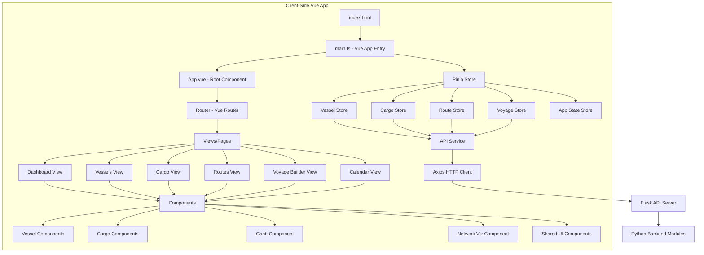
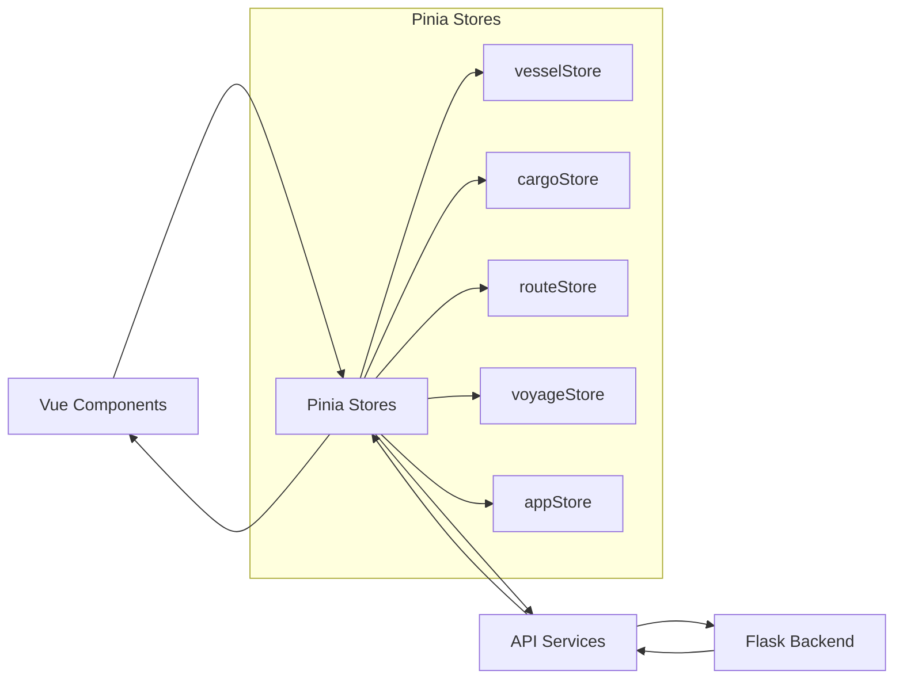
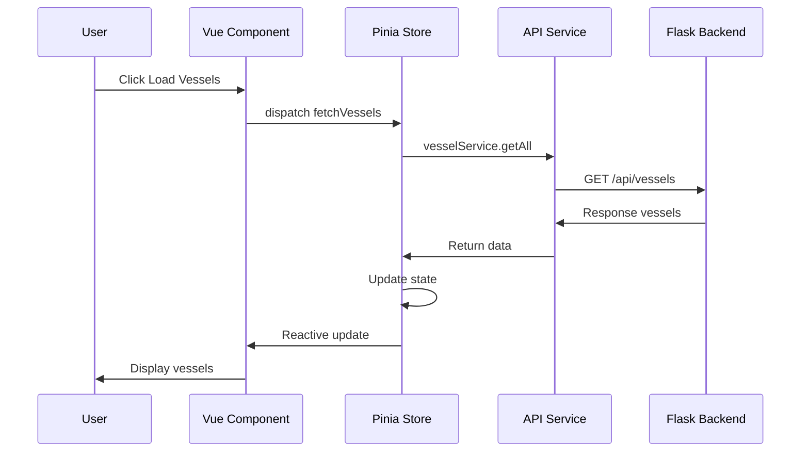

# Vue 3 Migration Plan

## Vessel Scheduler - Complete Frontend Modernization

**Created:** 2025-12-26  
**Status:** Planning Phase  
**Approach:** Full Vue 3 Migration with Pinia & Vue Router

---

##  Overview

This plan outlines the complete migration of the Vessel Scheduler frontend from vanilla JavaScript to a modern Vue 3 application with:

- **Vue 3** (Composition API) for reactive components
- **Pinia** for centralized state management
- **Vue Router** for navigation and routing
- **TypeScript** for type safety
- **Vite** for build tooling (already configured)

---

##  Current State Analysis

### Existing Architecture

- **Backend:** Python Flask API (api_server.py) running on port 5000/8000
- **Frontend:** Vanilla JavaScript with modular ES6 structure
- **Build Tool:** Vite already configured with TypeScript support
- **Styling:** CSS files (styles.css, operational_calendar.css, unified-dashboard.css)
- **Libraries:** vis-network, xlsx, html2pdf, leaflet

### Current Features to Migrate

1. **Dashboard** - Statistics and overview
2. **Vessel Management** - CRUD operations for vessels
3. **Cargo Management** - Cargo commitments and planning
4. **Route Management** - Route definitions and distances
5. **Voyage Builder** - Multi-step voyage creation
6. **Schedule Generator** - Calendar-based scheduling
7. **Gantt Chart** - Visual timeline display
8. **Network Visualization** - Port/route network diagram
9. **Financial Analysis** - Revenue and cost calculations
10. **Operational Calendar** - Time-based operations view
11. **Reports** - Excel/PDF export functionality

---

##  Target Architecture



---

##  Proposed Directory Structure

```
src/
├── main.ts                       # Vue app entry point
├── App.vue                       # Root component
├── router/
│   ├── index.ts                  # Router configuration
│   └── guards.ts                 # Navigation guards
├── stores/
│   ├── index.ts                  # Pinia store setup
│   ├── vessel.ts                 # Vessel state management
│   ├── cargo.ts                  # Cargo state management
│   ├── route.ts                  # Route state management
│   ├── voyage.ts                 # Voyage state management
│   └── app.ts                    # Global app state
├── views/
│   ├── Dashboard.vue             # Dashboard page
│   ├── VesselManagement.vue      # Vessel management page
│   ├── CargoManagement.vue       # Cargo management page
│   ├── RouteManagement.vue       # Route management page
│   ├── VoyageBuilder.vue         # Voyage builder page
│   ├── ScheduleView.vue          # Schedule/calendar page
│   ├── GanttView.vue             # Gantt chart page
│   ├── NetworkView.vue           # Network visualization page
│   ├── FinancialView.vue         # Financial analysis page
│   └── ReportsView.vue           # Reports page
├── components/
│   ├── layout/
│   │   ├── AppHeader.vue         # Main header
│   │   ├── AppSidebar.vue        # Navigation sidebar
│   │   ├── AppFooter.vue         # Footer
│   │   └── TheLayout.vue         # Main layout wrapper
│   ├── vessel/
│   │   ├── VesselList.vue        # Vessel table/list
│   │   ├── VesselForm.vue        # Vessel create/edit form
│   │   ├── VesselCard.vue        # Vessel info card
│   │   └── VesselFilters.vue     # Vessel filters
│   ├── cargo/
│   │   ├── CargoList.vue         # Cargo table/list
│   │   ├── CargoForm.vue         # Cargo create/edit form
│   │   ├── CargoCard.vue         # Cargo info card
│   │   └── CargoFilters.vue      # Cargo filters
│   ├── route/
│   │   ├── RouteList.vue         # Route table/list
│   │   ├── RouteForm.vue         # Route create/edit form
│   │   └── RouteMap.vue          # Route visualization
│   ├── voyage/
│   │   ├── VoyageWizard.vue      # Multi-step wizard
│   │   ├── VoyageStep1.vue       # Vessel selection step
│   │   ├── VoyageStep2.vue       # Cargo selection step
│   │   ├── VoyageStep3.vue       # Route configuration step
│   │   └── VoyageSummary.vue     # Final summary
│   ├── gantt/
│   │   ├── GanttChart.vue        # Main Gantt component
│   │   ├── GanttTimeline.vue     # Timeline renderer
│   │   └── GanttLegend.vue       # Legend component
│   ├── network/
│   │   └── NetworkDiagram.vue    # vis-network wrapper
│   ├── calendar/
│   │   ├── CalendarGrid.vue      # Calendar layout
│   │   └── CalendarEvent.vue     # Event renderer
│   ├── financial/
│   │   ├── FinancialSummary.vue  # Financial stats
│   │   └── CostBreakdown.vue     # Cost analysis
│   └── shared/
│       ├── BaseButton.vue        # Reusable button
│       ├── BaseModal.vue         # Modal dialog
│       ├── BaseTable.vue         # Data table
│       ├── BaseForm.vue          # Form wrapper
│       ├── BaseInput.vue         # Input field
│       ├── BaseSelect.vue        # Select dropdown
│       ├── BaseFilter.vue        # Filter component
│       ├── LoadingSpinner.vue    # Loading indicator
│       └── ErrorDisplay.vue      # Error message
├── composables/
│   ├── useApi.ts                 # API calls composable
│   ├── useValidation.ts          # Form validation
│   ├── useFilters.ts             # Data filtering
│   ├── usePagination.ts          # Pagination logic
│   ├── useExport.ts              # Excel/PDF export
│   └── useNotification.ts        # Toast notifications
├── services/
│   ├── api.ts                    # Axios instance & config
│   ├── vessel.service.ts         # Vessel API calls
│   ├── cargo.service.ts          # Cargo API calls
│   ├── route.service.ts          # Route API calls
│   ├── voyage.service.ts         # Voyage API calls
│   ├── schedule.service.ts       # Schedule API calls
│   └── export.service.ts         # Export API calls
├── types/
│   ├── vessel.types.ts           # Vessel type definitions
│   ├── cargo.types.ts            # Cargo type definitions
│   ├── route.types.ts            # Route type definitions
│   ├── voyage.types.ts           # Voyage type definitions
│   ├── api.types.ts              # API response types
│   └── index.ts                  # Barrel export
├── utils/
│   ├── formatters.ts             # Data formatting
│   ├── validators.ts             # Validation rules
│   ├── constants.ts              # App constants
│   └── helpers.ts                # Helper functions
└── assets/
    └── styles/
        ├── main.css              # Global styles
        ├── variables.css         # CSS variables
        └── transitions.css       # Vue transitions
```

---

##  Technical Implementation Details

### 1. Vue Setup

#### Dependencies to Add

```json
{
  "dependencies": {
    "vue": "^3.4.0",
    "vue-router": "^4.2.5",
    "pinia": "^2.1.7",
    "axios": "^1.6.0",
    "@vueuse/core": "^10.7.0"
  },
  "devDependencies": {
    "@vitejs/plugin-vue": "^5.0.0",
    "@vue/tsconfig": "^0.5.1",
    "vue-tsc": "^1.8.27"
  }
}
```

#### Vite Configuration Updates

```typescript
// vite.config.ts additions
import vue from '@vitejs/plugin-vue'

export default defineConfig({
  plugins: [
    vue(),
    // ... existing plugins
  ],
  resolve: {
    alias: {
      '@': path.resolve(__dirname, './src'),
      '@components': path.resolve(__dirname, './src/components'),
      '@views': path.resolve(__dirname, './src/views'),
      '@stores': path.resolve(__dirname, './src/stores'),
      '@services': path.resolve(__dirname, './src/services'),
      '@composables': path.resolve(__dirname, './src/composables'),
      '@types': path.resolve(__dirname, './src/types'),
      '@utils': path.resolve(__dirname, './src/utils'),
    }
  }
})
```

---

### 2. Core Components

#### State Management with Pinia



**Vessel Store Example:**

```typescript
// stores/vessel.ts
export const useVesselStore = defineStore('vessel', {
  state: () => ({
    vessels: [] as Vessel[],
    selectedVessel: null as Vessel | null,
    loading: false,
    error: null as string | null
  }),
  
  getters: {
    activeVessels: (state) => state.vessels.filter(v => v.status === 'Active'),
    vesselById: (state) => (id: string) => state.vessels.find(v => v.id === id)
  },
  
  actions: {
    async fetchVessels() {
      this.loading = true
      try {
        const response = await vesselService.getAll()
        this.vessels = response.data.vessels
      } catch (error) {
        this.error = 'Failed to load vessels'
      } finally {
        this.loading = false
      }
    },
    
    async createVessel(vessel: VesselInput) {
      // ... implementation
    },
    
    async updateVessel(id: string, updates: Partial<Vessel>) {
      // ... implementation
    }
  }
})
```

---

### 3. Routing Configuration

#### Route Structure

```typescript
// router/index.ts
const routes = [
  {
    path: '/',
    component: () => import('@/views/Dashboard.vue'),
    name: 'dashboard',
    meta: { title: 'Dashboard', icon: 'dashboard' }
  },
  {
    path: '/vessels',
    name: 'vessels',
    component: () => import('@/views/VesselManagement.vue'),
    meta: { title: 'Vessels', icon: 'ship' }
  },
  {
    path: '/cargo',
    name: 'cargo',
    component: () => import('@/views/CargoManagement.vue'),
    meta: { title: 'Cargo', icon: 'box' }
  },
  {
    path: '/routes',
    name: 'routes',
    component: () => import('@/views/RouteManagement.vue'),
    meta: { title: 'Routes', icon: 'route' }
  },
  {
    path: '/voyage-builder',
    name: 'voyage-builder',
    component: () => import('@/views/VoyageBuilder.vue'),
    meta: { title: 'Voyage Builder', icon: 'compass' }
  },
  {
    path: '/schedule',
    name: 'schedule',
    component: () => import('@/views/ScheduleView.vue'),
    meta: { title: 'Schedule', icon: 'calendar' }
  },
  {
    path: '/gantt',
    name: 'gantt',
    component: () => import('@/views/GanttView.vue'),
    meta: { title: 'Gantt Chart', icon: 'chart' }
  },
  {
    path: '/network',
    name: 'network',
    component: () => import('@/views/NetworkView.vue'),
    meta: { title: 'Network', icon: 'network' }
  },
  {
    path: '/financial',
    name: 'financial',
    component: () => import('@/views/FinancialView.vue'),
    meta: { title: 'Financial', icon: 'money' }
  },
  {
    path: '/reports',
    name: 'reports',
    component: () => import('@/views/ReportsView.vue'),
    meta: { title: 'Reports', icon: 'file' }
  }
]
```

---

### 4. Component Design Patterns

#### Composition API Pattern

```vue
<script setup lang="ts">
import { ref, computed, onMounted } from 'vue'
import { useVesselStore } from '@/stores/vessel'
import { useNotification } from '@/composables/useNotification'

const vesselStore = useVesselStore()
const { showSuccess, showError } = useNotification()

const vessels = computed(() => vesselStore.vessels)
const loading = computed(() => vesselStore.loading)

const selectedModule = ref('deepsea')
const filters = ref({
  search: '',
  status: 'all'
})

const filteredVessels = computed(() => {
  return vessels.value.filter(vessel => {
    // Filter logic
    return true
  })
})

async function handleCreate(vesselData) {
  try {
    await vesselStore.createVessel(vesselData)
    showSuccess('Vessel created successfully')
  } catch (error) {
    showError('Failed to create vessel')
  }
}

onMounted(() => {
  vesselStore.fetchVessels()
})
</script>

<template>
  <div class="vessel-management">
    <VesselFilters v-model="filters" />
    
    <LoadingSpinner v-if="loading" />
    
    <VesselList 
      v-else
      :vessels="filteredVessels"
      @create="handleCreate"
      @edit="handleEdit"
      @delete="handleDelete"
    />
  </div>
</template>

<style scoped>
.vessel-management {
  /* Component-specific styles */
}
</style>
```

---

##  Data Flow



---

##  Styling Strategy

### Vue Scoped Styles

- Use `<style scoped>` for component-specific styles
- Maintain existing CSS variables for theming
- Create shared styles in `assets/styles/`

### CSS Architecture

```
assets/styles/
├── main.css              # Global styles, resets
├── variables.css         # CSS custom properties
├── themes.css            # Dark/light themes
├── typography.css        # Font styles
└── transitions.css       # Vue transitions
```

---

##  Testing Strategy

### Component Testing

```typescript
// Example with Vitest
import { mount } from '@vue/test-utils'
import { createPinia } from 'pinia'
import VesselList from '@/components/vessel/VesselList.vue'

describe('VesselList', () => {
  it('renders vessel list correctly', () => {
    const wrapper = mount(VesselList, {
      global: {
        plugins: [createPinia()]
      },
      props: {
        vessels: mockVessels
      }
    })
    
    expect(wrapper.findAll('.vessel-item')).toHaveLength(mockVessels.length)
  })
})
```

---

##  Migration Strategy

### Phase-by-Phase Approach

#### Phase 1: Foundation Setup

1. Install Vue, Pinia, Vue Router
2. Configure Vite for Vue
3. Create basic directory structure
4. Set up main.ts and App.vue
5. Configure router with placeholder routes
6. Set up Pinia with basic stores

#### Phase 2: Core Layout & Navigation

1. Build TheLayout component
2. Create AppHeader with module selector
3. Create AppSidebar with navigation
4. Implement Vue Router navigation
5. Add loading states
6. Create shared UI components (buttons, modals, forms)

#### Phase 3: Data Layers

1. Set up API service with axios
2. Create all service files (vessel, cargo, route, etc.)
3. Implement Pinia stores with actions
4. Add error handling and loading states
5. Create composables for reusable logic

#### Phase 4: Feature Migration - Core CRUD

1. Migrate Vessel Management
   - VesselList component
   - VesselForm component
   - Vessel detail view
2. Migrate Cargo Management
   - CargoList component
   - CargoForm component
   - Cargo detail view
3. Migrate Route Management
   - RouteList component
   - RouteForm component
   - Route visualization

#### Phase 5: Feature Migration - Advanced Views

1. Build Dashboard
   - Statistics cards
   - Charts integration
   - Module selector
2. Build Voyage Builder
   - Wizard interface
   - Multi-step form
   - Validation
3. Build Schedule/Calendar View
   - Calendar grid
   - Event rendering
   - Date selection

#### Phase 6: Feature Migration - Visualizations

1. Build Gantt Chart Component
   - Wrap existing gantt-chart.js module
   - Vue reactive integration
   - Timeline rendering
2. Build Network Visualization
   - Wrap vis-network library
   - Interactive diagram
3. Build Financial Analysis
   - Charts and statistics
   - Cost breakdown

#### Phase 7: Testing & Optimization

1. Write component tests
2. Write store tests
3. Add E2E tests for critical workflows
4. Performance optimization
5. Code splitting and lazy loading
6. Bundle size optimization

#### Phase 8: Documentation & Deployment

1. Document component APIs
2. Create developer guide
3. Update user documentation
4. Production build configuration
5. Deployment testing

---

##  Key Benefits

### Developer Experience

- **Type Safety**: Full TypeScript support
- **Hot Module Replacement**: Instant feedback during development
- **Component Reusability**: DRY principle with Vue components
- **DevTools**: Vue DevTools for debugging

### Performance

- **Lazy Loading**: Routes loaded on demand
- **Code Splitting**: Smaller initial bundle
- **Reactive Updates**: Efficient DOM updates
- **Caching**: Better browser caching with chunked builds

### Maintainability

- **Single File Components**: Template, script, and styles together
- **Centralized State**: Predictable data flow
- **Composition API**: Better code organization
- **Type Definitions**: Self-documenting code

---

##  Development Workflow

### Local Development

```bash
# Install dependencies
npm install

# Run dev server with HMR
npm run dev

# Run Python backend (separate terminal)
python api_server.py

# Access application
# Frontend: http://localhost:5173
# Backend API: http://localhost:5000
```

### Build & Preview

```bash
# Type check
npm run type-check

# Build for production
npm run build

# Preview production build
npm run preview
```

---

##  Migration Checklist Summary

### Setup & Configuration

- [ ] Install Vue 3, Pinia, Vue Router
- [ ] Configure Vite with Vue plugin
- [ ] Set up TypeScript configuration
- [ ] Create src/ directory structure
- [ ] Configure path aliases

### Core Infrastructure

- [ ] Create main.ts entry point
- [ ] Build App.vue root component
- [ ] Set up Vue Router
- [ ] Configure Pinia stores
- [ ] Create API service layer

### Layout & Shared Components

- [ ] Build TheLayout component
- [ ] Create AppHeader, AppSidebar, AppFooter
- [ ] Build shared UI components (BaseButton, BaseModal, etc.)
- [ ] Implement responsive design

### Feature Implementation

- [ ] Dashboard view
- [ ] Vessel management (List, Form, Detail)
- [ ] Cargo management (List, Form, Detail)
- [ ] Route management (List, Form, Detail)
- [ ] Voyage builder wizard
- [ ] Schedule/Calendar view
- [ ] Gantt chart component
- [ ] Network visualization
- [ ] Financial analysis
- [ ] Reports and exports

### Quality & Testing

- [ ] Write component tests
- [ ] Write store tests
- [ ] Add E2E tests
- [ ] Performance optimization
- [ ] Accessibility improvements

### Documentation

- [ ] Component API documentation
- [ ] Developer guide
- [ ] User documentation update
- [ ] Deployment guide

---

##  Success Criteria

### Functional Requirements

-  All existing features migrated to Vue
-  API integration working correctly
-  Data persistence and state management
-  Excel/PDF export functionality
-  Multi-module support (deepsea, olya, balakovo)

### Technical Requirements

-  TypeScript strict mode enabled
-  No console errors or warnings
-  Lighthouse score > 90
-  Bundle size < 500KB initial load
-  Test coverage > 80%

### User Experience

-  Fast page transitions
-  Responsive on all devices
-  Intuitive navigation
-  Clear error messages
-  Loading states for async operations

---

##  Resources & References

### Vue 3 Documentation

- [Vue 3 Official Guide](https://vuejs.org/guide/)
- [Composition API](https://vuejs.org/guide/extras/composition-api-faq.html)
- [TypeScript with Vue](https://vuejs.org/guide/typescript/overview.html)

### Pinia Documentation

- [Pinia Official Docs](https://pinia.vuejs.org/)
- [State Management Guide](https://pinia.vuejs.org/core-concepts/)

### Vue Router

- [Vue Router Guide](https://router.vuejs.org/)
- [Lazy Loading Routes](https://router.vuejs.org/guide/advanced/lazy-loading.html)

### Best Practices

- [Vue Style Guide](https://vuejs.org/style-guide/)
- [Vue Testing Handbook](https://lmiller1990.github.io/vue-testing-handbook/)

---

##  Next Steps

1. **Review this plan** with the team
2. **Set up development environment** with all dependencies
3. **Start with Phase 1** (Foundation Setup)
4. **Iterate through phases** systematically
5. **Test continuously** throughout development
6. **Document as you go** for future reference

---

**Plan Version:** 1.0  
**Last Updated:** 2025-12-26  
**Status:** Ready for Implementation
